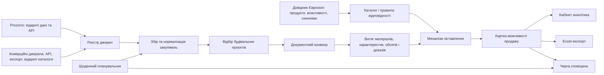

# Архітектура застосунку аналізу закупівель Євроізол

> Статус: документ для погодження. Реалізацію, публікацію, щоденний моніторинг і зовнішні сповіщення не запущено.

## 1. Мета

Застосунок виявляє державні та комерційні будівельні закупівлі, читає доступну тендерну й технічну документацію, знаходить матеріали та їхні обсяги, зіставляє їх із продукцією Євроізол і формує зрозумілий реєстр можливостей продажу в інтерфейсі та Excel.

Цільові види робіт:

- нове будівництво;
- реконструкція;
- капітальний ремонт будівель і споруд;
- благоустрій;
- суміжні роботи, де можуть використовуватися матеріали Євроізол.

## 2. Межі рішення

### Входить до системи

- Prozorro як базове відкрите джерело;
- реєстр комерційних джерел із контрольованим доступом;
- поповнюваний довідник продукції Євроізол;
- пошук точних назв, синонімів і функціональних напрямів матеріалів;
- аналіз доступних документів та збереження доказу для кожного висновку;
- ручна перевірка сумнівних відповідностей;
- щоденний моніторинг, журнал змін і недубльовані сповіщення;
- експорт відібраних результатів до Excel.

### Не входить без окремого погодження

- обхід обмежень сайтів, закритих кабінетів або платних баз;
- автоматичне твердження про технічну еквівалентність без правил довідника;
- автоматичне подання пропозицій на тендер;
- публікація застосунку або створення зовнішніх облікових записів.

## 3. Логічна схема

## 4. Компоненти

### 4.1 Реєстр джерел

Для кожного джерела зберігаються назва, тип, адреса, метод доступу, частота оновлення, статус і правила використання.

| Джерело | Плановий спосіб | Роль |
|---|---|---|
| Prozorro | Відкриті дані та API | Основний автоматизований потік |
| Salesbook, SmartTender, Playtender | Офіційний відкритий доступ, API або експорт після перевірки | Комерційні закупівлі |
| BAU-data, Сучасна Будівельна Біржа | Погоджений доступ або експорт | Будівельні об'єкти, потреби та тендери |
| Tender.In.Ua, Rabotniki.ua | Відкритий каталог після оцінки якості | Додаткові комерційні ліди |
| Відкриті дані та класифікатори | Відкриті набори даних | Термінологія, класифікація, збагачення |

Для комерційних джерел статус доступу має бути одним із: `автоматично`, `потрібен API/експорт`, `ручний імпорт`, `не використовувати`. Система не повинна обходити технічні або договірні обмеження платформи.

Усі закупівлі поділяються на два окремі блоки: **бюджетні закупівлі** (державні, комунальні та інші закупівлі за публічні кошти, насамперед Prozorro) і **комерційні закупівлі** (тендери бізнесу, девелоперів і приватних замовників). Тип закупівлі є обов'язковим полем, відображається окремими реєстрами в інтерфейсі та не змішується в Excel-експорті.

#### Підтверджений стан доступів до комерційних джерел

Перевірено за публічними сторінками платформ 1 жовтня 2026 року. Перед підключенням у кожному випадку потрібні договір, тарифи та письмове підтвердження дозволеного способу отримання даних.

| Платформа | Підтверджений публічний спосіб | Архітектурне рішення |
|---|---|---|
| [SmartTender](https://smarttender.biz/commercial/taryfy-komertsiyni/) | Комерційний тариф заявляє API-інтеграцію та експорт у Excel; платформа також має комерційні торги | Пріоритетне джерело: інтеграція через погоджений API або експорт |
| [PlayTender](https://playtender.com.ua/zak/user-organization-membership/tariffs) | Заявлені Excel/PDF-звіти, Excel-експорт та інтеграція з 1С/SAP | Підключення через погоджений експорт або інтеграційний канал; публічний API окремо підтверджується постачальником |
| [Salesbook](https://salesbook.com.ua/tarify/for_supplier) | Доступ за корпоративним тарифом і через обліковий запис; є цільові розсилки та повідомлення | Підключення після запиту API або регулярного експорту; публічний API не вважати підтвердженим |
| [BAU-data](https://baudata.com.ua/) | Публічно заявлено тестовий доступ до бази будівельних об'єктів і тендерів | Запитати ліцензію та доступний формат експорту/API; до відповіді — не автоматизувати |
| [Сучасна Будівельна Біржа](https://sbb.net.ua/) | Публічно заявлена щоденно оновлювана база будівельних об'єктів і тендерів | Запитати ліцензію та формат експорту/API; до відповіді — не автоматизувати |
| Tender.In.Ua, Rabotniki.ua | Відкриті каталоги оголошень | Використовувати лише після перевірки правил використання та наявності офіційного експорту/API |

LUN і «Building Online» не додаються до автоматизованих джерел, поки не буде підтверджено, що вони мають релевантний каталог закупівель і дозволений механізм доступу.

### 4.2 Довідник Євроізол

Довідник є версійованим і поповнюваним: нові файли або рядки додаються без зміни програмного коду. Кожна позиція містить:

- внутрішній ідентифікатор позиції;
- точну назву продукту та базову назву матеріалу;
- категорію, підкатегорію та функціональне призначення;
- структурований набір технічних характеристик: назва параметра, значення, одиниця виміру, допустиме відхилення та ознака `обов'язкова` або `додаткова`;
- синоніми, варіанти написання й ключові слова;
- дозволені напрями-аналогі;
- статус: `підтверджено`, `потребує перевірки`, `не пропонувати`;
- джерело і дату версії.

Імпорт довідника створює нову версію. За потреби запускається переаналіз історичних закупівель, але попередні висновки й їхні докази зберігаються.

Обов'язковими для зіставлення є **назва матеріалу та його характеристики**. Наприклад, характеристики можуть охоплювати тип і склад матеріалу, товщину, щільність, міцність, водонепроникність, паропроникність, клас горючості, розміри, стандарт або інші параметри, релевантні конкретній категорії. Для різних видів матеріалів набір обов'язкових параметрів налаштовується окремо.

### 4.3 Конвеєр закупівель і документів

1. Завантаження нових і змінених оголошень.
2. Нормалізація назви, замовника, дати, бюджету, регіону, статусу та посилань.
3. Первинний відбір за CPV, назвою та будівельними ключовими словами.
4. Завантаження доступних технічних і тендерних документів.
5. Виділення тексту з PDF, DOCX, XLSX та, за потреби, OCR для сканованих файлів.
6. Виявлення матеріалів, характеристик, одиниць виміру, обсягів і фрагментів-доказів.
7. Передавання результатів у механізм зіставлення.

Для кожної знахідки зберігаються документ, сторінка або аркуш, фрагмент тексту та посилання. Це робить висновок перевірюваним менеджером або технічним фахівцем.

### 4.4 Механізм зіставлення

Зіставлення відбувається послідовно:

1. назва матеріалу в закупівлі проти точної назви, базової назви, синонімів і варіантів написання в довіднику;
2. характеристики з документації проти обов'язкових і додаткових параметрів продукту Євроізол;
3. категорія матеріалу: наприклад, геотекстиль, мембрана, гідроізоляція, теплоізоляція, покрівельний або дренажний матеріал;
4. перевірка критичних параметрів, одиниць виміру та допустимих відхилень;
5. рішення аналітика, якщо назва або хоча б одна обов'язкова характеристика не підтверджена.

Можливі результати:

| Результат | Значення |
|---|---|
| Точний збіг | Назва матеріалу та всі наявні обов'язкові характеристики відповідають позиції довідника |
| Функціональний аналог | Автоматично знайдений кандидат за призначенням; у картці й повідомленні позначається як такий, що потребує перевірки |
| Потребує перевірки | Даних недостатньо, вимоги неоднозначні або не підтверджена назва чи характеристика; можливість виділяється для уваги користувача |
| Немає відповідника | Не знайдено обґрунтованої позиції Євроізол |

Відкриті дані можуть розширювати словник термінів, але не можуть самостійно створювати підтверджений технічний аналог.

#### Автоматичне зіставлення та позначення сумнівів

Система виконує зіставлення автоматично та не створює окремих запитів на затвердження. Якщо вона не може підтвердити назву матеріалу, хоча б одну обов'язкову характеристику, одиницю виміру або технічну сумісність, картка виділяється статусом `потребує перевірки`.

Лист-повідомлення для такої можливості обов'язково містить позначку **«Потрібно перевірити»** та коротку причину: наприклад, «не знайдено щільність», «товщина відрізняється від вимоги» або «збіг виявлено лише за функціональним напрямом». Лист також містить назву матеріалу, знайдені характеристики, запропоновану позицію Євроізол і посилання на фрагмент документації.

### 4.5 Картка можливості продажу

Картка об'єднує дані закупівлі, документні докази та рекомендацію:

- джерело й посилання на закупівлю;
- замовник, регіон, бюджет і строк подання;
- назва й статус закупівлі;
- переможець торгів і доступні публічні контакти після оприлюднення результату;
- знайдений матеріал, характеристики, одиниця виміру та обсяг;
- посилання на документ і фрагмент доказу;
- продукт Євроізол і тип відповідності;
- рівень упевненості та обов'язковість ручної перевірки;
- пріоритет;
- робочий статус: `нова`, `перевіряється`, `у роботі`, `нецільова`, `подано пропозицію`.

### 4.6 Щоденний моніторинг і сповіщення

Планувальник щодня виконує два запуски за київським часом: **основний о 09:00** та **додатковий о 18:00**. Кожен запуск виконує збір, аналіз і порівняння з попереднім станом. Часовий пояс має зберігатися як `Europe/Kyiv`, щоб перехід на літній або зимовий час оброблявся коректно. У архітектурі це запланований процес; він не вважається запущеним, доки не буде окремо погоджено реалізацію та підключення джерел.

Повідомлення створюється лише коли:

- знайдено нову релевантну закупівлю;
- змінилися строк, бюджет, документація або перелік матеріалів;
- після оновлення довідника для вже відомої закупівлі з'явився новий відповідник.

Журнал сповіщень зберігає ідентифікатор закупівлі, версію змін і час відправлення, щоб уникати повторів. **Основний канал сповіщень у цій архітектурній версії — електронна пошта.** Лист надсилається лише за новою або суттєво зміненою можливістю та містить замовника, строк подання, матеріал або напрям, короткий висновок і посилання на закупівлю. Внутрішній центр повідомлень і Telegram можуть бути додані як наступне окремо погоджене розширення.

### 4.7 Excel-експорт

Експорт формується за вибраними фільтрами й містить окремі аркуші `Бюджетні закупівлі` та `Комерційні закупівлі`; також можна експортувати лише один блок. Мінімальні колонки кожного аркуша:

| Джерело | Посилання | Закупівля | Замовник | Регіон | Бюджет | Строк | Матеріал | Характеристика/контекст | Обсяг | Продукт Євроізол | Тип відповідності | Переможець | Контакти переможця | Пріоритет | Доказ |
|---|---|---|---|---|---:|---|---|---|---|---|---|---|---|---|---|

Excel повинен містити зрозумілі заголовки, автофільтр, форматування дат і сум, посилання та окреме поле для примітки аналітика. Для активної закупівлі колонки `Переможець` і `Контакти переможця` залишаються порожніми. Після оприлюднення результату система відстежує закупівлю, оновлює ці поля назвою компанії-переможця та доступними публічними контактами. Якщо джерело не містить контакти, фіксується позначка «немає у відкритих даних».

## 5. Дані та контроль якості

- Первинні дані, нормалізовані записи, результати аналізу й рішення користувача зберігаються окремо.
- Кожен автоматичний висновок має джерело, правило й рівень упевненості.
- Рішення аналітика має пріоритет над автоматичним висновком.
- Помилкові спрацювання та підтверджені відповідності використовуються для покращення правил.
- Документи, дані замовників і доступи обробляються відповідно до правил відповідного джерела та чинного законодавства.

## 6. Ролі

| Роль | Права |
|---|---|
| Адміністратор | Джерела, доступи, довідник, правила, канали сповіщень |
| Аналітик | Перевірка виділених сумнівних зіставлень і документів |
| Менеджер із продажу | Робота з можливостями, фільтри, Excel-експорт, статуси |
| Перегляд | Перегляд карток і звітів без зміни даних |

## 7. Етапи реалізації після затвердження

1. **Основа:** структура даних, імпорт довідника, картка можливості й Excel-експорт.
2. **Prozorro:** автоматичний збір, первинний відбір, аналіз документів і ручна перевірка.
3. **Правила відповідності:** словник, аналоги, оцінка впевненості та журнал рішень.
4. **Комерційні джерела:** підключення лише після підтвердження доступу й правил використання кожної платформи.
5. **Моніторинг:** щоденний планувальник, дедуплікація та погоджені канали сповіщень.
6. **Удосконалення:** покращення правил на базі рішень аналітиків і нових версій довідника.

## 8. Рішення, які потрібні перед реалізацією

1. Канал сповіщень погоджено: електронна пошта.
2. Які комерційні джерела мають офіційний доступ, експорт чи ліцензію.
3. Які поля є обов'язковими у вашому довіднику Євроізол.
4. Погоджено: зіставлення автоматичне; сумнівні назви, характеристики або аналоги виділяються в картці та в листі як такі, що потребують перевірки.
5. Погоджено: основна перевірка о 09:00 та додаткова перевірка о 18:00 за київським часом.
